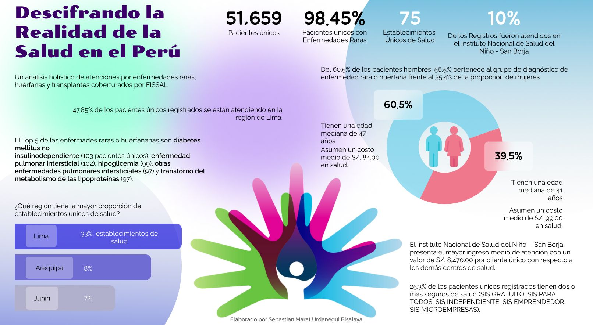

# **Enfermedades raras, huérfanas y transplantes solventados por el Fondo Intangible Solidario de Salud (FISSAL)**

Realizado por **Sebastian Marat Urdanegui Bisalaya**

### **Principales hallazgos:**
